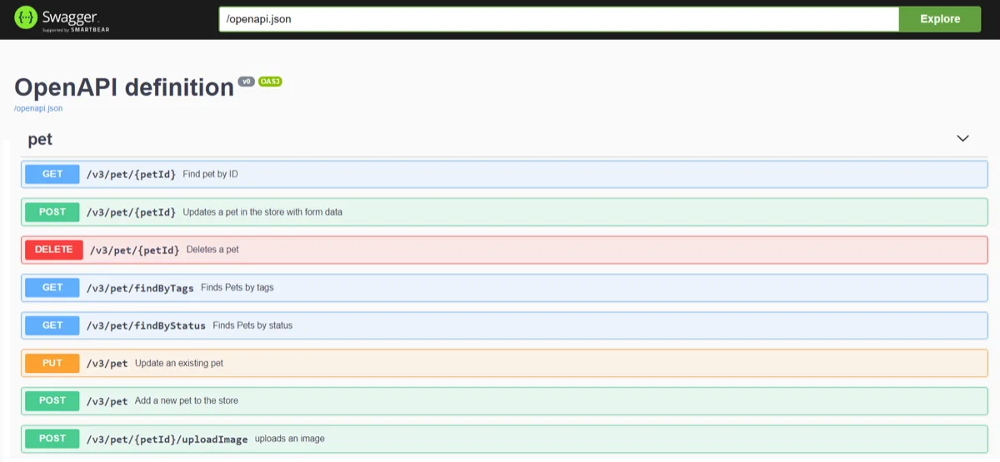

ifndef::springdoc-aggregate[]
= springdoc-openapi Live Demos
:toc: left
:toclevels: 3
:sectanchors:
:icons: font
:hide-uri-scheme:
endif::[]

[[demos]]
== Springdoc-openapi Demos

=== springdoc applications demos
* link:https://demos.springdoc.org/demo-spring-boot-webmvc[Demo Spring Boot 4 Web MVC with OpenAPI 3, window="_blank"]
* link:https://demos.springdoc.org/demo-spring-boot-webflux/swagger-ui.html[Demo Spring Boot 4 WebFlux with OpenAPI 3, window="_blank"]
* link:https://demos.springdoc.org/demo-spring-boot-webmvc-scalar/scalar[Demo Spring Boot 4  Web MVC with OpenAPI 3 and Scalar, window="_blank"]
* link:https://demos.springdoc.org/demo-spring-boot-webflux-scalar/scalar[Demo Spring Boot 4 WebFlux with OpenAPI 3 and Scalar, window="_blank"]
* link:https://demos.springdoc.org/demo-spring-boot-webflux-functional/swagger-ui.html[Demo Spring Boot 4 WebFlux with Functional endpoints OpenAPI 3, window="_blank"]
* link:https://demos.springdoc.org/demo-spring-hateoas[Demo Spring Boot 4 and Spring Hateoas with OpenAPI 3, window="_blank"]
* link:https://demos.springdoc.org/spring-cloud-function-webmvc[Demo Spring Boot 4 and Spring Cloud Function Web MVC, window="_blank"]
* link:https://demos.springdoc.org/spring-cloud-function-webflux/swagger-ui.html[Demo Spring Boot 4 and Spring Cloud Function WebFlux, window="_blank"]
* link:https://demos.springdoc.org/demo-microservices/swagger-ui.html[Demo Spring Boot 4 and Spring Cloud Gateway, window="_blank"]
* link:https://demos.springdoc.org/demo-spring-boot-mcp/mcp-ui/index.html[Demo Spring Boot 4 with MCP Support, window="_blank"]

=== Source code of the Demo Applications
*   link:https://github.com/springdoc/springdoc-openapi-demos/tree/master[https://github.com/springdoc/springdoc-openapi-demos/tree/master, window="_blank"]

include::{docdir}/_ad-in-article.adoc[]
